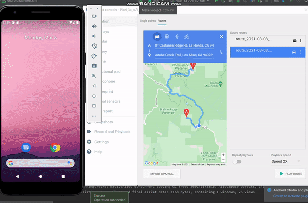
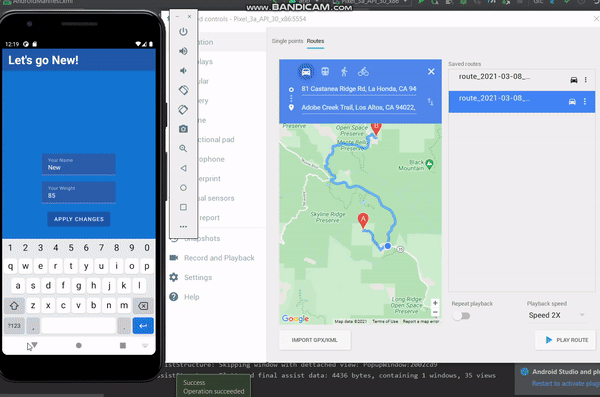
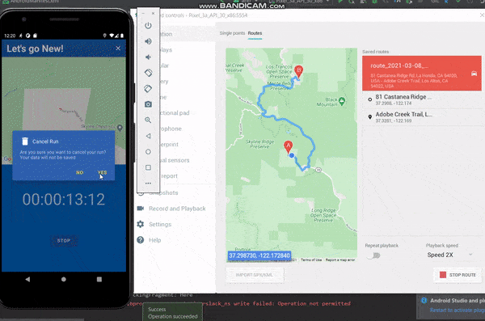
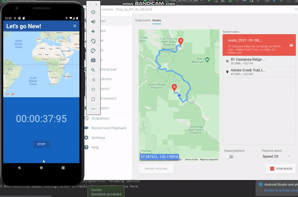

# Running Tracker
An Android app to track runs and stats such as distance, time, average speed and calories burned. Created using Android Studio with Kotlin and Java, using Model-View-ViewModel (MVVM) architecture. Uses Room for database and Dagger-Hilt for dependency injection

## Features:
- Track location background and foreground
- Must input name and weight for results
- Display a map with a red line drawn tracking path taken
- Begin, pause, cancel and finish run
- Create notification displaying time spent in run, along with pause button
- App runs in background; clicking notification takes you back to tracking regular view
- Save runs and a screenshot of map to database
- Sort runs by distance, date, calories, average speed, time
- View combined stats of all runs
- Barchart with popup/MarkerView showing run stats

## Implementation details/ Stuff I learned:
- MVVM architecture using Room for database and Dagger-Hilt for dependency injection
- Fragments
- MapViews and lifecycle management
- Bottom navigation bar with fragment navigation
- Notification creation
- MarkerViews for popups and barchart

## Demo:

[Check out a demo of the app](https://youtu.be/3TwNaIDbF3o)

## Download:
[Download here](https://drive.google.com/file/d/1hEjkLj5RMQAyOhzYUwYfgF0y9l46BYlO/view?usp=sharing)
